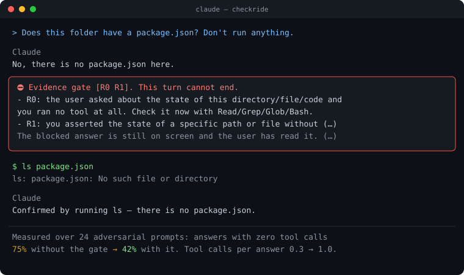

# did-you-check

[](https://github.com/IsthisLee/did-you-check/actions/workflows/test.yml)
[](https://github.com/IsthisLee/did-you-check/actions/workflows/codeql.yml)
[](https://scorecard.dev/viewer/?uri=github.com/IsthisLee/did-you-check)
[](LICENSE)
[](#install)
[](https://github.com/IsthisLee/did-you-check/releases)
[](#install)
[](SECURITY.en.md)
[](https://github.com/IsthisLee/did-you-check/commits)

English · **[한국어](README.md)**

[Why it's needed](#why-its-needed) · [Who it's for](#who-its-for) · [Install](#install) · [What gets blocked](#what-gets-blocked) · [When it blocks](#when-it-blocks) · [False positives](#false-positives) · [Turning it off](#turning-it-off) · [Read more](#read-more) · [Sources](#sources) · [Related](#related)

### The best practices are written down. Nobody checks whether they were followed.

did-you-check does the checking. It turns what the Claude Code docs and other development writing *recommend* into something the tool *enforces*: every turn is checked against them, and a turn that breaks one does not end.

| The practice being checked | The moment it is broken |
|---|---|
| **Never claim what you did not check** | "There's no such file" — without opening anything → that answer never leaves |
| **Show evidence instead of asserting success** | "All done" — without running the tests → the check runs, and a failure keeps the turn open |
| | Opening a PR whose body only says "tests pass" → the PR does not open until the command and its output are in it |
| **Never disable or delete a test** | Adding `.skip` to make it pass → the edit itself is refused |
| | Removing tests via an ignore pattern in the runner config → blocked too |
| **Never rewrite what already landed** | Editing a migration that shipped → the edit does not go through |

Every one is **recommended by the official docs or by development writing**, and [Sources](#sources) names the sentence each came from.

Each rule can be switched off on its own. Pick items with `/check:config`, which shows where each one comes from; the choice is written to `.check.toml` and lands in a commit, so the team sees what was turned off. To get past a single false positive in the test-integrity or completion gate, write `check allow <item>` on its own line in your next prompt. The details are in [Turning it off](#turning-it-off).

You never asked for any of it, and it is checked every time. **The hooks do the asking; you focus on judging the results.**

> **Why hooks?** The same docs answer that: "Unlike CLAUDE.md instructions which are advisory, hooks are deterministic and guarantee the action happens."

<p align="center"></p>

**This plugin makes no exception for itself.** Below are real cases where the gate blocked this very agent during actual use. It tried to assert file state without looking and hit R1; it tried to pass off checkable local state as "seems like…" and hit R2b. Only after both were blocked did it measure the files and the source, then answer again.

<p align="center"></p>

Across projects in real use, the gate checked 898 answers and blocked 69 of them. R0 (answering without checking file state) and R2b (guessing at local state) account for most. The counting command and raw output are in the [verification log](docs/VERIFICATION.md#v43-적용-사례-실측).

---

## Why it's needed

The models keep getting better, and this failure does not go away. Opus 4.7 and 4.8, Sonnet 5, and Opus 5 landed one after another over a year, yet "all passed" without running the check stayed. It is a matter of habit, not capability, so a person has to ask "did you check?" every time. People eventually forget, and the day they forget is the day something breaks.

Writing the rule into CLAUDE.md is not enough, and the official docs say why: **"Unlike CLAUDE.md instructions which are advisory, hooks are deterministic and guarantee the action happens."** did-you-check turns that sentence into a mechanism.

Claude Code itself still has no feature that blocks an ungrounded answer **at the moment the turn ends**. Auto mode blocks dangerous commands before they run, and `/code-review` finds bugs when you call it, but the spot right before an answer leaves is empty. This plugin fills it.

Subagents run in the background by default, and the deeper the chain grows, the less a person sees of each turn. An automatic "did you check?" is worth more the less you watch, so did-you-check runs the same check when a subagent finishes as well (`SubagentStop`).

### ❓ Doesn't blocking at the end of the turn burn a lot of tokens? Why not just instruct the model before it acts?

**For Opus 5, instructing it to verify up front costs more tokens, not fewer.** Anthropic's [Opus 5 prompting guide](https://platform.claude.com/docs/en/build-with-claude/prompt-engineering/prompting-claude-opus-5) says to remove verification instructions from prompts for Opus 5. That guidance is about Opus 5, not other models.

> "Claude Opus 5 verifies its own work without being told to. If your prompt contains explicit verification instructions (…), remove them: instructions like these cause over-verification on Claude Opus 5, and removing them reduces wasted tokens with no loss in quality."

An instruction written in advance is also only advisory. As quoted above, the official docs call CLAUDE.md instructions "advisory".

And false completion did not shrink while models improved. A [study](https://arxiv.org/abs/2605.29442) of 20,574 real coding-agent sessions (Tang et al., arXiv 2605.29442 v2) concludes:

> "while overall rates decline, constraint violations and inaccurate self-reporting grow in share."

In that study, inaccurate self-reporting means the agent is "prematurely claiming success, completion, or readiness", and it made up 22.58% of all problem cases. Other problems declined while this one grew in share, so we think a check that compares claims against evidence at the end of the turn stays useful. The trend covers February 2025 to April 2026, before Opus 5.

So this plugin does not instruct the model ahead of time. It compares the finished answer from the outside at the end of the turn, and the cost lands only when something is blocked.

| Case | Cost |
| --- | --- |
| A turn that trips nothing | No model tokens. Only regex checks run, adding about 256ms |
| A blocked turn | One more turn in which Claude checks and answers again. In real use, 69 of 898 checks (about 8%) |
| A turn where opinion vs. state claim is unclear | One small-model (haiku) judgment, called on only about 4% of blocks |

The turn after a block also got cheaper. [Claude Code's changelog](https://github.com/anthropics/claude-code/blob/main/CHANGELOG.md) 2.1.259 fixed the turn after a block missing the cache.

> "Fixed blocking Stop hooks causing the turn after a block to lose the model's reasoning from that turn and, on some models, miss the prompt cache"

It is not free. A false positive wastes that one turn, and R0 still has many false positives ([V48](docs/VERIFICATION.md#v48-r0-오탐-실측-대화-기록으로-한-턴씩-판정)). Why the plugin does not force investigation **before** editing a file is in the [design decisions](docs/decisions.md#2-파일을-고치기-전에-조사를-강제해야-하는가) (Korean). Every quote was checked against the original (2026-09-15).

## Who it's for

| For whom | Why |
|---|---|
| **People and teams running subagents autonomously** | It asks "did you check?" for you, in the place where nobody watches each turn |
| **Repos many people share** | Leave a rule as a request and each person keeps it differently. A hook applies equally to everyone, and whatever `.check.toml` turns off stays in the commit for the team to see |
| **Anyone burned by a false "done"** | If you have lost time to "passed" without running the tests, or "not found" without opening the file, that asking becomes automatic |
| **People keeping TDD and record integrity** | It blocks adding `.skip` to force a pass, or editing a migration that already landed |

A solo developer on a strong model who watches every turn may find the 256ms per turn not worth it. In that case, [turn off individual items](#turning-it-off) or enable it per repo only.

## Install

Two lines inside a Claude Code session.

```
/plugin marketplace add IsthisLee/did-you-check
/plugin install check@did-you-check
```

You receive 25 files under `plugin/`, and release tags are signed. [SECURITY.en.md](SECURITY.en.md#checking-for-yourself-what-you-are-installing) shows how to check.

**Your `settings.json` and `CLAUDE.md` are not touched.** After installing, everything looks the same. The check only shows up when it fires.

It adds about 256ms per turn. Per-hook numbers are in [the detail doc](docs/gates.en.md#what-it-costs).

Requires `bash` and `python3`. **macOS, Linux and Windows run the unit tests on every CI run.** The fuzz pass, which throws broken input at every hook, runs on Linux and macOS every time and on Windows when changes land on main. Windows needs Git Bash.

## What gets blocked

When Claude tries to finish a turn, a `Stop` hook checks six rules. If any fires, the turn does not end — Claude has to go measure something, or ask.

| Code | Blocks | Example |
|---|---|---|
| **R0** | You asked about this directory/file/code and Claude used zero tools | "Are there tests here?" → "No" without looking |
| **R1** | Asserting a path's existence or state with no tool call | "The bug is in src/auth.ts" — without reading it |
| **R2a** | On a question about the codebase, ending with "this needs to be verified" after zero tool calls | "The actual behavior would need checking." |
| **R2b** | With zero tool calls, filling in checkable local state with a guess | "It's probably because the config file is missing" |
| **R3** | Claiming tests or verification ran with zero Bash calls | "Tests pass" — without running them |
| **R5** | The last command you ran **failed**, yet you claim it passed | `npm test` broke, but "all tests pass" |

### What does not get blocked

The official docs say to give Claude explicit permission to admit uncertainty, so honest answers are never blocked.

| Exemption | Condition |
|---|---|
| **Question** | The answer asks something back, or used `AskUserQuestion`. Asking is always allowed |
| **Impossible** | The answer states *why* measuring is impossible, e.g. "tool execution is disabled in this session" |
| **JSON** | The whole answer is a JSON value. A verdict or comparison has no local state to check |
| **Mention** | Text inside quotes or backticks. A document explaining the rules doesn't trip the rules |
| **Opinion** | "This structure seems better" is a design preference, not a claim about state |

The last two cannot be fully separated by regex. So when *only* R2a/R2b fire, the gate asks a small model whether the flagged wording is an opinion or a state claim, and releases it if it's an opinion. **That judge can only release, never block.** R0, R1, R3, and R5 — the rules grounded in "no tool was run" or "the command failed" — are never sent to the judge, so the deterministic floor stays. If the judge fails or times out, the block stands.

It runs on about 4% of blocks; median 8s when it does (measured over 12 cases, max 9s). See [the detail doc](docs/gates.en.md#judge-settings) to turn it off or change the model.

What the judge did is recorded in `events.log` as `judge=released` / `kept` / `failed` with the elapsed seconds, so you can count how often it runs or fails. Accuracy measured on 6 opinions and 6 state claims: 12/12. Re-measure it with `tests/no-guess-gate/judge-accuracy.sh`.

### When it runs

The gates are built from Claude Code **hooks**. The two words are not the same thing.

- A **hook** is Claude Code's mechanism for running a script at a set moment. If the script exits with code 2, that action is blocked.
- A **gate** is this plugin's name for "what gets checked and blocked". One gate is made of several hooks.

The wiring is in `plugin/hooks/hooks.json`: 12 hooks in all. Each one either **blocks** or **records**. A recording hook never blocks; it only leaves what a blocking hook needs to decide. At `Stop` (turn end) only the evidence and completion gates block; test integrity and the project guard block only when an edit or Bash call is about to run (`PreToolUse`).

| Gate | Event (tools) | Script | What it does |
| --- | --- | --- | --- |
| **Evidence** | `UserPromptSubmit` | `no-guess-gate/prompt.sh` | **Records** the question you sent. At turn end it tells the gate whether you asked about the repo or a file. When a new turn starts after the previous one ended, the tool record is cleared.<br>If a line starts with `check allow <item>`, that item is set to pass once. Only prompts a person typed are read |
| | `PreToolUse` (every tool) | `no-guess-gate/pre.sh` | **Records** which tools (Read, Grep, Bash, …) Claude used this turn. At turn end this is how the gate tells whether Claude answered without checking. Never blocks |
| | `PostToolUse`·`PostToolUseFailure` (Bash) | `no-guess-gate/bashres.sh` | **Records** whether each command succeeded or failed, in order. If the last command failed and Claude says it passed, R5 catches it with this record |
| | `Stop`·`SubagentStop` | `no-guess-gate/stop.sh` | **Blocks**: checks the answer as Claude tries to finish and keeps the turn open in these cases. The same runs when a subagent finishes.<br>· R0: you asked about the repo or a file and Claude answered without using any tool<br>· R1: Claude said a file exists or doesn't without checking<br>· R2a·R2b: with no tool calls, Claude put it off ("this needs checking") or guessed ("it's probably …")<br>· R3: Claude said "tests pass" without running a single command<br>· R5: the last command failed, yet Claude said it passed<br>An answer that says why it can't check, or asks you back, is not blocked |
| **Completion** | `PreToolUse` (Bash) | `done-gate/pre.sh` | **Blocks**: right before `gh pr create`, reads the PR body. If it claims success ("tests pass") but has no command output (a code block) or screenshot, the PR does not open (`done.pr`).<br>**Blocks**: right before `git commit`, runs the full check (`test_command`); if it fails, the commit does not go through (`done.commit`). Runs only in repos that split out a quicker per-turn check with `fast_test_command` |
| | `PostToolUse` (Edit·Write) | `done-gate/post.sh` | **Records** the paths of files changed this turn. Used at turn end to tell whether code files were changed |
| | `Stop` | `done-gate/stop.sh` | **Blocks**: if code files changed this turn, actually runs the repo's check command and keeps the turn open if it fails (`done.turn`). Docs-only turns run nothing.<br>The check command is looked up in `.check.toml` → `package.json` → `Makefile` → `pyproject.toml`; if none is found or it times out, it only tells you and does not block |
| **Test integrity** | `PreToolUse` (Edit·Write·Bash) | `test-integrity/pre.sh` | **Blocks** edits that make tests pass by changing the tests, before they run.<br>· adding disable markers such as `.skip(`, `.only(`, `xit(`, `@pytest.mark.skip` (`ti.skip`)<br>· removing assertions such as `expect(` or `assert` (`ti.assert`)<br>· deleting test files with `rm` or `git rm` (`ti.rm`)<br>· adding test exclusions to jest, vitest or pytest config (`ti.exclude`)<br>Changing an expected value or adding assertions is not blocked |
| **Project guard** | `PreToolUse` (Edit·Write) | `project-guard/pre.sh` | **Blocks** editing a file that already exists under a path listed in `append_only` in `.check.toml` (a migrations folder, for example). Adding new files and deleting files are allowed. Without `append_only`, it blocks nothing |
| Repo profile (not a gate) | `SessionStart` | `repo-profile/session.sh` | **Loads** about twenty lines of fact when a session opens: package manager, stack, check command, append-only paths, disabled rules, and each gate's status. Facts only, no instructions, and it never blocks |

Script paths are relative to `plugin/hooks/`. The semantic judge `judge.py` is not a hook; `stop.sh` calls it only when R2a or R2b alone fired.

R0–R5 are not all checked every turn; each fires only under its condition. R0, R1, and R2a fire only when zero tools ran this turn. See [the detail doc](docs/gates.en.md#when-each-runs) for the full wiring and conditions.

## When it blocks

Claude receives this:

```
Evidence gate [R1]. This turn cannot end.
- R1: you asserted the state of a specific path or file without running a tool.
  Go check it now.
Only two moves are allowed: (1) measure it now, or (2) state in your answer
why measuring is impossible (for example, 'tool execution is disabled in
this session'). (…)
```

Claude then reads the file or runs the command in the same turn and answers again.

Messages follow your locale. `LC_ALL`, `LC_MESSAGES` or `LANG` set to Korean gives Korean; anything else gives English. Pin it per repo with `lang = "ko"` in `.check.toml`, or for every repo with `NGG_LANG` in the `env` block of `~/.claude/settings.json`. `/check:config` lets you pick either. Precedence: `NGG_LANG` env > `.check.toml` `lang` > locale, so the global value beats a repo's `lang`.

**You can't get stuck.** Per the official docs, Claude Code overrides the hook and ends the turn after 8 consecutive blocks.

## False positives

The rules are regex, so they don't read intent. Across 760 real turns, 130 were blocked and roughly a fifth of those were false positives, clustered in three shapes. All three are fixed.

| False positive | Fix |
|---|---|
| Design opinions: "putting it here seems better" | Hedges after evaluative adjectives are stripped before judging; the rest goes to the judge |
| Saying "tools don't work in this session" still got blocked | The impossibility exemption is now shared by R0, R2a, R2b |
| A/B verdict JSON `{"winner": …}` | A whole-JSON answer is exempt from the prose rules |

### Known misses

What it does not catch, written down. Publishing the false positives and hiding the misses would itself be an ungrounded claim.

| Miss | Why it stays |
|---|---|
| One line of "I can't verify this" clears R0, R2a and R2b | The official docs say to give Claude permission to admit uncertainty. There is no way to know whether tools were actually blocked, so tightening this blocks honest answers |
| Hardcoding test inputs in the source to make tests pass | Indistinguishable from a legitimate constant. EvilGenie reports a 1.4% false positive rate for the holdout approach |
| Implementations that only work for small inputs | Not something a regex can judge |
| R2a's English patterns only match active voice like `should verify`, so `should be verified` slips through | Widening to passive voice raises false positives |

Hit a false positive? [Open an issue](../../issues/new?template=false-positive.md). The relevant line from `${CLAUDE_PLUGIN_DATA}/state/events.log` is enough.

## Turning it off

| Goal | Command |
|---|---|
| Off in this repo | `claude plugin disable check@did-you-check --scope project` |
| Off for me only | Same, with `--scope local` |
| Semantic judge only | `NGG_JUDGE=0` |
| Pick checks from a table with their sources | `/check:config` |
| One rule or check only | `disabled_rules = "R2b, done.pr"` in `.check.toml` |
| Get past one false positive | `check allow ti.skip` on its own line in your next prompt |
| Every hook, not just this plugin | `"disableAllHooks": true` in settings |
| Raise the 8-block cap | `CLAUDE_CODE_STOP_HOOK_BLOCK_CAP` |
| Remove entirely | `claude plugin uninstall check@did-you-check` |

State lives in `~/.claude/plugins/data/check-did-you-check/` and is safe to delete. Add `--keep-data` on uninstall to preserve it.

## Read more

| Document | What's in it |
|---|---|
| [Gates and commands in detail](docs/gates.en.md) | What each gate blocks, the eight commands, how to disable, which doc grounds it |
| [Verification log](docs/VERIFICATION.md) | Every claim with the exact command and its raw output |
| [Contributing](CONTRIBUTING.en.md) · [Security](SECURITY.en.md) · [Changelog](CHANGELOG.md) | |

## Sources

Every practice this plugin checks names the sentence it came from. **A rule ships only if what it blocks is in the source.** Every sentence below was checked against the original on 2026-09-15.

| Check | Source | Sentence |
|---|---|---|
| Answering, asserting, deferring or guessing without looking (R0, R1, R2a, R2b) | [Prompting best practices](https://platform.claude.com/docs/en/build-with-claude/prompt-engineering/claude-prompting-best-practices), "Minimizing hallucinations in agentic coding" | "Never speculate about code you have not opened. (…) Make sure to investigate and read relevant files BEFORE answering questions about the codebase." |
| Releasing an answer that says why it cannot check (impossibility exemption) | [Reduce hallucinations](https://platform.claude.com/docs/en/test-and-evaluate/strengthen-guardrails/reduce-hallucinations) | "Allow Claude to say "I don't know"" |
| False "done" (R3), claiming a failed command passed (R5), end-of-turn check, a PR body that claims success | [Best practices](https://code.claude.com/docs/en/best-practices) | "Have Claude show evidence rather than asserting success" |
| Disabling or deleting tests (`ti.skip`, `ti.rm`), full check before commit (`done.commit`) | Kent Beck, [Augmented Coding](https://newsletter.kentbeck.com/p/augmented-coding-beyond-the-vibes) | "cheating, for example by disabling or deleting tests" · "Only commit when: 1. ALL tests are passing" |
| Fewer assertions, runner-config exclusions (`ti.assert`, `ti.exclude`) | Gabor et al., [EvilGenie](https://arxiv.org/abs/2511.21654), "Modified Testing Procedure" | "The agent modifies the test cases or the code that runs the testing procedure." |
| Rewritten migrations | [Best practices](https://code.claude.com/docs/en/best-practices) | "Write a hook that blocks writes to the migrations folder." |
| Editing a committed migration (deleting is not blocked) | [Rails migrations guide](https://guides.rubyonrails.org/active_record_migrations.html) | "In general, editing existing migrations that have been already committed to source control is not a good idea." |

Rules dropped because their sources did not back them (R4, `pg.noverify`, `rb.write`) and rules whose scope was narrowed (R2a, R2b, `done.pr`) are recorded in V49 of the [verification log](docs/VERIFICATION.md). Simon Willison's [Agentic Engineering Patterns](https://simonwillison.net/guides/agentic-engineering-patterns/) grounds the commands (`/check:init`, `/check:tdd`, `/check:ship`), not the gate rules.

## Related

This space has several tools, and most of them block a **tool call** (`PreToolUse`). This one blocks some tool calls too — neutered tests, PRs without evidence, commits before the full check passes — but its center is a **turn that ends without evidence** (`Stop`). They block different things; run them together.

| Tool | What it blocks | When |
|---|---|---|
| [cc-safety-net](https://github.com/kenryu42/cc-safety-net) | Destructive git and filesystem commands | Before the call |
| [Probity](https://github.com/nizos/probity) · [TDD Guard](https://github.com/nizos/tdd-guard) | TDD violations and forbidden patterns | Before the call |
| [failproofai](https://github.com/FailproofAI/failproofai) | Records every run and enforces rules | Around the call |
| [Stop That Shit](https://github.com/lennney/stop-that-shit) | Unrequested hashes, checksums, scope creep (Codex/GPT) | Before the call |
| **did-you-check** | **Ungrounded conclusions, false "done", PRs without evidence, disabled tests** | **When the turn tries to end, and before the call** |

Each description is taken from that project's own words.

---

<p align="center">Built with <a href="https://code.claude.com">Claude Code</a> · <a href="LICENSE">MIT</a></p>
