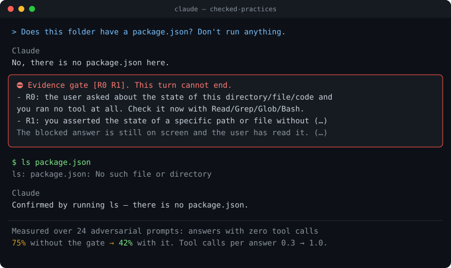
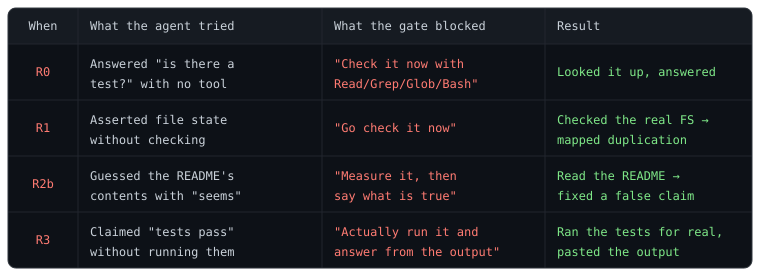

# did-you-check

[](https://github.com/IsthisLee/did-you-check/actions/workflows/test.yml)
[](https://github.com/IsthisLee/did-you-check/actions/workflows/codeql.yml)
[](https://scorecard.dev/viewer/?uri=github.com/IsthisLee/did-you-check)
[](LICENSE)
[](#install)
[](https://github.com/IsthisLee/did-you-check/releases)
[](#install)
[](SECURITY.en.md)
[](https://github.com/IsthisLee/did-you-check/commits)

English · **[한국어](README.md)**

### The best practices are written down. Nobody checks whether they were followed.

did-you-check does the checking. It turns what the Claude Code docs and other development writing *recommend* into something the tool *enforces*: every turn is checked against them, and a turn that breaks one does not end.

| The practice being checked | The moment it is broken |
|---|---|
| **Never claim what you did not check** | "There's no such file" — without opening anything → that answer never leaves |
| **Show evidence instead of asserting success** | "All done" — without running the tests → the check runs, and a failure keeps the turn open |
| | Opening a PR whose body only says "tests pass" → the PR does not open until the command and its output are in it |
| **Never disable or delete a test** | Adding `.skip` to make it pass → the edit itself is refused |
| | Removing tests via an ignore pattern in the runner config → blocked too |
| **Never rewrite what already landed** | Editing a migration that shipped → blocked before the commit |

Every one is **recommended by the official docs or by development writing**, and [Sources](#sources) names the sentence each came from.

You never asked for any of it, and it is checked every time. **The point is that you get to forget.**

> **Why hooks?** The same docs answer that: "Unlike CLAUDE.md instructions which are advisory, hooks are deterministic and guarantee the action happens."

<p align="center"></p>

**This plugin makes no exception for itself.** Below are real cases where the gate blocked this very agent during actual use. It tried to assert file state without looking and hit R1; it tried to pass off checkable local state as "seems like…" and hit R2b. Only after both were blocked did it measure the files and the source, then answer again.

<p align="center"></p>

Across projects in real use, the gate checked 898 answers and blocked 69 of them. R0 (answering without checking file state) and R2b (guessing at local state) account for most. The counting command and raw output are in the [verification log](docs/VERIFICATION.md#v43-적용-사례-실측).

---

## Install

Two lines inside a Claude Code session.

```
/plugin marketplace add IsthisLee/did-you-check
/plugin install check@did-you-check
```

You receive 25 files under `plugin/`, and release tags are signed. [SECURITY.en.md](SECURITY.en.md#checking-for-yourself-what-you-are-installing) shows how to check.

**Your `settings.json` and `CLAUDE.md` are not touched.** After installing, everything looks the same. The check only shows up when it fires.

It adds about 256ms per turn. Per-hook numbers are in [the detail doc](docs/gates.en.md#what-it-costs).

Requires `bash` and `python3`. **macOS, Linux and Windows run the unit tests on every CI run.** The fuzz pass, which throws broken input at every hook, runs on Linux and macOS every time and on Windows when changes land on main. Windows needs Git Bash.

## What gets blocked

When Claude tries to finish a turn, a `Stop` hook checks seven rules. If any fires, the turn does not end — Claude has to go measure something, or ask.

| Code | Blocks | Example |
|---|---|---|
| **R0** | You asked about this directory/file/code and Claude used zero tools | "Are there tests here?" → "No" without looking |
| **R1** | Asserting a path's existence or state with no tool call | "The bug is in src/auth.ts" — without reading it |
| **R2a** | Ending with "this needs to be verified" after zero tool calls | "The actual behavior would need checking." |
| **R2b** | Filling in checkable local state with a guess | "It's probably because the config file is missing" |
| **R3** | Claiming tests or verification ran with zero Bash calls | "Tests pass" — without running them |
| **R4** | After a block, ending again without a single tool call | Apology, then stop |
| **R5** | The last command you ran **failed**, yet you claim it passed | `npm test` broke, but "all tests pass" |

### What does not get blocked

The official docs say to give Claude explicit permission to admit uncertainty, so honest answers are never blocked.

| Exemption | Condition |
|---|---|
| **Question** | The answer asks something back, or used `AskUserQuestion`. Asking is always allowed |
| **Impossible** | The answer states *why* measuring is impossible, e.g. "tool execution is disabled in this session" |
| **JSON** | The whole answer is a JSON value. A verdict or comparison has no local state to check |
| **Mention** | Text inside quotes or backticks. A document explaining the rules doesn't trip the rules |
| **Opinion** | "This structure seems better" is a design preference, not a claim about state |

The last two cannot be fully separated by regex. So when *only* R2a/R2b fire, the gate asks a small model whether the flagged wording is an opinion or a state claim, and releases it if it's an opinion. **That judge can only release, never block.** R0, R1, R3, and R4 — the rules grounded in "no tool was run" — are never sent to the judge, so the deterministic floor stays. If the judge fails or times out, the block stands.

It runs on about 4% of blocks; median 8s when it does (measured over 12 cases, max 9s). See [the detail doc](docs/gates.en.md#judge-settings) to turn it off or change the model.

What the judge did is recorded in `events.log` as `judge=released` / `kept` / `failed` with the elapsed seconds, so you can count how often it runs or fails. Accuracy measured on 6 opinions and 6 state claims: 12/12. Re-measure it with `tests/no-guess-gate/judge-accuracy.sh`.

## When it blocks

Claude receives this:

```
Evidence gate [R1]. This turn cannot end.
- R1: you asserted the state of a specific path or file without running a tool.
  Go check it now.
Only two moves are allowed: (1) measure it now, or (2) state in your answer
why measuring is impossible (for example, 'tool execution is disabled in
this session'). (…)
```

Claude then reads the file or runs the command in the same turn and answers again.

Messages follow your locale. `LC_ALL`, `LC_MESSAGES` or `LANG` set to Korean gives Korean; anything else gives English. `NGG_LANG=ko` or `NGG_LANG=en` overrides that.

**You can't get stuck.** Per the official docs, Claude Code overrides the hook and ends the turn after 8 consecutive blocks.

## False positives

The rules are regex, so they don't read intent. Across 760 real turns, 130 were blocked and roughly a fifth of those were false positives, clustered in three shapes. All three are fixed.

| False positive | Fix |
|---|---|
| Design opinions: "putting it here seems better" | Hedges after evaluative adjectives are stripped before judging; the rest goes to the judge |
| Saying "tools don't work in this session" still got blocked | The impossibility exemption is now shared by R0, R2a, R2b, R4 |
| A/B verdict JSON `{"winner": …}` | A whole-JSON answer is exempt from the prose rules |

### Known misses

What it does not catch, written down. Publishing the false positives and hiding the misses would itself be an ungrounded claim.

| Miss | Why it stays |
|---|---|
| One line of "I can't verify this" clears R0, R2a, R2b and R4 | The official docs say to give Claude permission to admit uncertainty. There is no way to know whether tools were actually blocked, so tightening this blocks honest answers |
| Hardcoding test inputs in the source to make tests pass | Indistinguishable from a legitimate constant. EvilGenie reports a 1.4% false positive rate for the holdout approach |
| Implementations that only work for small inputs | Not something a regex can judge |
| R2a's English patterns only match active voice like `should verify`, so `should be verified` slips through | Widening to passive voice raises false positives |

Hit a false positive? [Open an issue](../../issues/new?template=false-positive.md). The relevant line from `${CLAUDE_PLUGIN_DATA}/state/events.log` is enough.

## Turning it off

| Goal | Command |
|---|---|
| Off in this repo | `claude plugin disable check@did-you-check --scope project` |
| Off for me only | Same, with `--scope local` |
| Semantic judge only | `NGG_JUDGE=0` |
| Pick checks from a table with their sources | `/check:config` |
| One rule or check only | `disabled_rules = "R2b, done.pr"` in `.check.toml` |
| Get past one false positive | `check allow ti.skip` on its own line in your next prompt |
| Every hook, not just this plugin | `"disableAllHooks": true` in settings |
| Raise the 8-block cap | `CLAUDE_CODE_STOP_HOOK_BLOCK_CAP` |
| Remove entirely | `claude plugin uninstall check@did-you-check` |

State lives in `~/.claude/plugins/data/check-did-you-check/` and is safe to delete. Add `--keep-data` on uninstall to preserve it.

## Read more

| Document | What's in it |
|---|---|
| [Gates and commands in detail](docs/gates.en.md) | What each gate blocks, the eight commands, how to disable, which doc grounds it |
| [Verification log](docs/VERIFICATION.md) | Every claim with the exact command and its raw output |
| [Contributing](CONTRIBUTING.en.md) · [Security](SECURITY.en.md) · [Changelog](CHANGELOG.md) | |

## Sources

Every practice this plugin checks names the sentence it came from. A rule with no source does not ship.

| Check | Source | Sentence |
|---|---|---|
| Claims without evidence (R0, R1, R2a, R2b, R4) | [Reduce hallucinations](https://platform.claude.com/docs/en/test-and-evaluate/strengthen-guardrails/reduce-hallucinations) | "If it can't find a quote, it must retract the claim" |
| False "done" (R3), end-of-turn check, PR body | [Best practices](https://code.claude.com/docs/en/best-practices) | "Have Claude show evidence rather than asserting success" |
| Disabled tests | Kent Beck, [Augmented Coding](https://newsletter.kentbeck.com/p/augmented-coding-beyond-the-vibes) | "cheating, for example by disabling or deleting tests" |
| Rewritten migrations | [Hooks](https://code.claude.com/docs/en/hooks) | "Write a hook that blocks writes to the migrations folder." |

Simon Willison's [Agentic Engineering Patterns](https://simonwillison.net/guides/agentic-engineering-patterns/) is a source too. Every rule cites its sentence in [the detail doc](docs/gates.en.md#sources).

## Related

This space has several tools, and most of them block a **tool call** (`PreToolUse`). This one blocks some tool calls too — neutered tests, PRs without evidence, commits before the full check passes — but its center is a **turn that ends without evidence** (`Stop`). They block different things; run them together.

| Tool | What it blocks | When |
|---|---|---|
| [cc-safety-net](https://github.com/kenryu42/cc-safety-net) | Destructive git and filesystem commands | Before the call |
| [Probity](https://github.com/nizos/probity) · [TDD Guard](https://github.com/nizos/tdd-guard) | TDD violations and forbidden patterns | Before the call |
| [failproofai](https://github.com/FailproofAI/failproofai) | Records every run and enforces rules | Around the call |
| [Stop That Shit](https://github.com/lennney/stop-that-shit) | Unrequested hashes, checksums, scope creep (Codex/GPT) | Before the call |
| **did-you-check** | **Ungrounded conclusions, false "done", PRs without evidence, disabled tests** | **When the turn tries to end, and before the call** |

Each description is taken from that project's own words.

---

<p align="center">Built with <a href="https://code.claude.com">Claude Code</a> · <a href="LICENSE">MIT</a></p>
