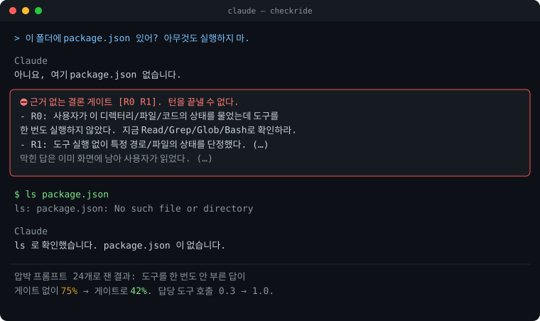
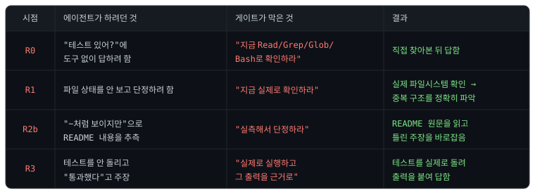

# did-you-check


[무엇이 막히나](#무엇이-막히나) · [설치](#설치) · [막히면 어떻게 되나](#막히면-어떻게-되나) · [왜 필요한가](#왜-필요한가) · [누구에게 좋은가](#누구에게-좋은가) · [오탐](#오탐) · [끄기와 제거](#끄기와-제거) · [더 읽기](#더-읽기) · [근거](#근거) · [비슷한 도구](#비슷한-도구)

**읽기:** 한국어 · [English](README.en.md)

---

**Claude가 모범 사례를 지켰는지 턴마다 확인합니다.**

Claude Code 공식 문서를 비롯한 여러 개발 문서가 권하는 모범 사례를 Claude가 실제로 지키는지, 턴이 끝날 때마다 확인합니다. 지키지 않은 답으로는 턴이 끝나지 않으므로, Claude는 스스로 확인한 뒤 다시 답합니다. 규칙은 항목마다 끌 수 있습니다.

| 검사하는 모범 사례                          | 훅이 발동하는 상황                                                                                                                                                                         |
| ------------------------------------------- | ------------------------------------------------------------------------------------------------------------------------------------------------------------------------------------------ |
| **주장에는 근거를 댑니다**                  | 열어 보지도 않고 "그런 파일 없습니다" → 그 답이 나가지 못합니다                                                                                                                            |
| **성공을 주장하기 전에 근거를 보여 줍니다** | 테스트를 안 돌리고 "다 됐습니다" → 검사가 자동으로 돌고 실패하면 턴이 끝나지 않습니다<br>본문에 "통과했습니다"만 적고 PR을 열려 함 → 돌린 명령과 출력을 붙이기 전에는 PR이 열리지 않습니다 |
| **테스트는 손대지 않고 코드를 고칩니다**    | 통과시키려고 `.skip`을 붙임 → 그 편집 자체가 이뤄지지 않습니다<br>설정에 제외 패턴을 넣어 테스트를 뺌 → 그것도 막힙니다                                                                            |
| **이미 쌓인 기록에는 덧붙입니다**           | 이미 올라간 마이그레이션을 고치려 함 → 그 편집이 되지 않습니다                                                                                                                             |

네 가지 사례는 모두 **공식 문서와 개발 문서가 권하는 내용입니다.** 각 사례가 어느 문장에서 나왔는지는 [근거](#근거)에 정리해 두었습니다.

`/check:config`로 항목의 출처를 보고 고르면 그 선택이 `.check.toml`에 적히고 커밋에 남으므로, 무엇을 껐는지 팀이 함께 봅니다. 테스트 무결성·완료 게이트에서 오탐 한 건만 넘기려면 다음 프롬프트에 `check allow <항목>`을 한 줄로 쓰면 됩니다. 자세한 방법은 [끄기와 제거](#끄기와-제거)에 있습니다.

사용자가 한 번도 부탁하지 않아도 매번 검사합니다. **되묻는 일은 훅이 맡고, 사용자는 결과를 판단하는 데 집중하면 됩니다.**

왜 부탁이 아니라 훅으로 만들었는지는 [왜 필요한가](#왜-필요한가)에 적었습니다.

<p align="center">
  
</p>

**이 플러그인은 자기 자신에게도 예외를 두지 않습니다.** 아래는 실제 사용 중에 게이트가 이 에이전트를 막았던 사례입니다. 파일을 열어 보지도 않고 단정하려다 R1에 걸렸고, 확인할 수 있는 로컬 상태를 "~처럼 보인다"라고 얼버무리려다 R2b에 걸렸습니다. 두 경우 모두 막힌 뒤에야 파일과 원문을 직접 확인하고 다시 답했습니다.

<p align="center">
  
</p>

여러 프로젝트에서 실제로 쓰는 동안, 게이트는 답을 898번 검사해 그중 69번을 막았습니다. 파일 상태를 확인하지 않고 답하는 R0과 로컬 상태를 추측하는 R2b가 대부분을 차지합니다. 이 수치를 세는 명령과 원문은 [검증 기록](docs/VERIFICATION.md#v43-적용-사례-실측)에 있습니다.

---

## 무엇이 막히나

Claude가 답을 마치려는 순간, `Stop` 훅이 규칙 여섯 개를 검사합니다. 그중 하나라도 걸리면 턴이 끝나지 않고, Claude는 직접 확인하거나 사용자에게 물어본 뒤 다시 답합니다.

| 코드    | 막는 경우                                                                | 예                                         |
| ------- | ------------------------------------------------------------------------ | ------------------------------------------ |
| **R0**  | 사용자가 이 디렉터리·파일·코드의 상태를 물었는데 도구를 한 번도 쓰지 않음    | "여기 테스트 있어?" → 확인 없이 "없습니다" |
| **R1**  | 도구 없이 특정 경로·파일의 존재나 상태를 단정                            | "src/auth.ts에 버그가 있다" (읽지 않고)      |
| **R2a** | 코드베이스에 관한 질문에 도구를 한 번도 쓰지 않고 "확인이 필요하다"로 끝냄 | "실제 동작은 확인이 필요합니다."로 끝      |
| **R2b** | 도구를 한 번도 쓰지 않고 확인 가능한 로컬 상태를 추정으로 메움             | "아마 설정 파일이 없어서일 겁니다"         |
| **R3**  | Bash 실행 0건인데 테스트·검증을 했다고 주장                              | "테스트 통과했습니다" (돌리지 않고)          |
| **R5**  | 마지막으로 돌린 명령이 **실패**했는데 통과·검증을 주장                   | `npm test`가 깨졌는데 "전부 통과했습니다"  |

### 걸리지 않는 것

공식 문서는 Claude가 모른다고 말할 수 있게 하라고 권합니다. 그래서 정직한 답은 막지 않습니다.

| 면제     | 조건                                                                      |
| -------- | ------------------------------------------------------------------------- |
| **질문** | 답에 되묻는 문장이 있거나 `AskUserQuestion`을 썼습니다. 묻는 것은 언제나 허용됩니다   |
| **불가** | "이 세션에서는 도구 실행이 안 된다"처럼 실측이 불가능한 이유를 밝혔습니다 |
| **JSON** | 답 전체가 JSON 값입니다. 판정·비교 출력에는 확인할 로컬 상태가 없습니다   |
| **인용** | 따옴표나 백틱 안에 있는 표현입니다. 규칙을 설명하는 글이 규칙에 걸리지 않습니다        |
| **의견** | "이 구조가 나아 보인다"는 설계 의견이지 상태 주장이 아닙니다              |

마지막 두 면제는 정규식만으로는 다 가려내지 못합니다. 그래서 R2a·R2b만 걸렸을 때는 **작은 모델에게 그 문장이 의견인지 상태 주장인지 물어보고, 의견이면 풀어 줍니다.** 이 판정은 풀어 주기만 할 뿐 새로 막지는 못합니다. 도구를 돌리지 않은 사실이나 실패한 명령을 잡아내는 R0·R1·R3·R5는 애초에 판정 대상이 아닙니다. 그래서 훅이 결정적으로 막는다는 바탕은 그대로 남습니다. 판정이 실패하거나 제한 시간을 넘기면, 답을 막은 채로 둡니다.

판정이 불리는 턴은 전체 차단의 약 4%이고, 판정이 불리면 걸리는 시간은 중앙값이 8초입니다(실측 12건, 최대 9초). 판정기를 끄거나 다른 모델로 바꾸는 법은 [상세 문서](docs/gates.md#의미-판정기-설정)에 있습니다.

판정기가 무엇을 했는지는 `events.log`에 남습니다. `judge=released` / `kept` / `failed`와 걸린 시간이 함께 적히므로, 판정이 도는지 실패하는지 직접 셀 수 있습니다. 정확도는 의견 6건과 상태 주장 6건으로 쟀고, 결과는 12/12였습니다. 이 값은 `tests/no-guess-gate/judge-accuracy.sh`로 다시 잴 수 있습니다.

### 언제 도나

게이트는 Claude Code의 **훅**으로 만들어져 있습니다. 둘은 같은 말이 아닙니다.

- **훅**은 Claude Code가 정해진 순간에 스크립트를 돌리는 장치입니다. 스크립트가 exit 2로 끝나면 그 동작을 막습니다.
- **게이트**는 이 플러그인이 "무엇을 검사해 막는가"를 기준으로 붙인 이름입니다. 게이트 하나가 훅 여러 개로 이뤄집니다.

배선은 `plugin/hooks/hooks.json`에 있고, 훅은 모두 12개입니다. 그중 막는 것은 다섯이고, 나머지는 막는 훅이 판정할 때 쓸 정보만 남깁니다.

| 게이트            | 언제 막나                                           | 무엇을 막나                                                       |
| ----------------- | --------------------------------------------------- | ----------------------------------------------------------------- |
| **근거**          | 턴이 끝나는 순간(`Stop`·`SubagentStop`)             | 확인하지 않은 단정, 유보, 추측, 거짓 검증 주장(R0~R5)             |
| **완료**          | 턴이 끝나는 순간과 `git commit`·`gh pr create` 직전 | 검사가 실패한 턴의 종료, 근거 없는 PR 본문, 검사가 깨진 커밋      |
| **테스트 무결성** | 편집·Bash를 실행하려는 순간(`PreToolUse`)           | 테스트 끄기, 단언 줄이기, 테스트 파일 삭제, 러너 설정의 제외 추가 |
| **프로젝트 가드** | 편집을 실행하려는 순간(`PreToolUse`)                | `append_only` 경로에 이미 있는 파일의 수정                        |

저장소 프로필은 게이트가 아닙니다. 세션을 열 때 저장소에 관한 사실을 스무 줄 안팎으로 실어 주고, 아무것도 막지 않습니다. 훅 열둘이 각각 무엇을 하는지는 [상세 문서](docs/gates.md#훅-열둘이-각각-하는-일)에 있습니다.

**사람이 보고 있지 않은 세션에서는 근거 게이트가 돌지 않습니다.** `claude -p`로 띄운 세션의 답은 사람에게 보이지 않아 되물을 상대가 없기 때문입니다. CI에서 그 세션까지 검사하려면 `NGG_HEADLESS=1`을 설정합니다.

게이트는 R0~R5를 매 턴 전부 검사하지 않고, 조건이 맞는 규칙만 봅니다. R0·R1·R2a는 이 턴에 도구를 하나도 쓰지 않았을 때만 걸립니다. 자세한 배선과 조건은 [상세 문서](docs/gates.md#언제-무엇이-도나)에 있습니다.

## 설치

Claude Code 세션 안에서 다음 두 줄을 입력하면 됩니다.

```
/plugin marketplace add IsthisLee/did-you-check
/plugin install check@did-you-check
```

내려받는 것은 `plugin/` 아래 25개 파일뿐이고, 릴리스 태그에는 서명이 붙어 있습니다. 서명을 직접 확인하는 법은 [SECURITY.md](SECURITY.md#설치할-것을-직접-확인하는-법)에 있습니다.

**사용자의 `settings.json`과 `CLAUDE.md`는 한 글자도 바뀌지 않습니다.** 설치해도 평소와 똑같고, 검사는 무언가에 걸릴 때만 나타납니다.

턴마다 약 256ms가 더 붙습니다. 훅별로 실측한 값은 [상세 문서](docs/gates.md#얼마나-느려지나)에 있습니다.

필요한 것은 `bash`와 `python3` 두 가지입니다. **macOS · Linux · Windows 세 곳 모두 CI에서 매번 단위 테스트를 돌립니다.** 망가진 입력을 던지는 fuzz 테스트는 Linux·macOS에서는 매번 돌고, Windows에서는 main에 올라갈 때 돕니다. Windows에서는 Git Bash가 설치돼 있어야 합니다.

## 막히면 어떻게 되나

Claude는 이런 메시지를 받습니다.

```
근거 없는 결론 게이트 [R1]. 턴을 끝낼 수 없다.
- R1: 도구 실행 없이 특정 경로/파일의 상태를 단정했다. 지금 실제로 확인하라.
허용되는 행동은 둘뿐이다. (1) 지금 실측한다 (2) 실측이 불가능한 이유를
답에 적는다(예: '이 세션에서는 도구 실행이 안 된다'). (…)
```

그리고 Claude는 같은 턴 안에서 파일을 읽거나 명령을 돌린 뒤 다시 답합니다.

**무한정 갇히는 일은 없습니다.** 공식 문서에 나온 대로, 8회 연속 차단되면 Claude Code가 훅을 무시하고 턴을 끝냅니다.

## 왜 필요한가

모델은 갈수록 좋아지는데도 이 실패만은 사라지지 않습니다. Opus 4.7·4.8, Sonnet 5, Opus 5가 한 해 동안 차례로 나왔지만, 검사를 돌리지도 않고 "다 통과했습니다"라고 답하는 일은 그대로 남았습니다. 이 실패가 능력의 문제가 아니라 습관의 문제이기 때문입니다. 그래서 사람이 매번 "확인했어?"라고 되물어야 하는데, 사람은 언젠가 그것을 잊어버리고, 잊은 날에 사고가 납니다.

CLAUDE.md에 규칙을 적어 두는 것만으로는 부족합니다. 공식 문서가 그 이유를 이렇게 밝힙니다. **"권고에 그치는 CLAUDE.md 지시와 달리, 훅은 결정적이고 그 동작이 반드시 일어나게 보장한다."** did-you-check는 이 문장을 실제 장치로 옮겨 놓은 것입니다.

Claude Code 자체에는 근거 없이 끝나는 답을 **턴이 끝나는 순간에** 막아 주는 기능이 아직 없습니다. auto 모드는 위험한 명령을 실행하기 전에 막고, `/code-review`는 사용자가 불렀을 때 버그를 찾습니다. 그러나 답이 사용자에게 나가기 직전을 지키는 자리는 비어 있습니다. 이 플러그인이 그 자리를 채웁니다.

서브에이전트는 기본적으로 백그라운드에서 돌고, 그 호출 체인이 깊어질수록 사람이 매 턴을 눈으로 확인하기 어려워집니다. 자동으로 되묻는 장치는 사람이 덜 볼수록 오히려 쓸모가 커집니다. did-you-check는 서브에이전트가 끝나는 순간에도 같은 검사를 돌립니다(`SubagentStop`).

### ❓ 턴이 끝나는 순간에 막으면 토큰이 너무 늘지 않나요? 행동 전에 지시해 두면 되지 않나요?

**Opus 5에게는 행동 전에 검증을 지시해 두는 쪽이 오히려 토큰을 더 씁니다.** Anthropic의 [Opus 5 프롬프트 가이드](https://platform.claude.com/docs/en/build-with-claude/prompt-engineering/prompting-claude-opus-5)는 Opus 5에게 주는 프롬프트에서 검증 지시를 지우라고 안내합니다. 다른 모델에 대한 안내는 아닙니다.

> "Claude Opus 5 verifies its own work without being told to. If your prompt contains explicit verification instructions (…), remove them: instructions like these cause over-verification on Claude Opus 5, and removing them reduces wasted tokens with no loss in quality."
>
> 번역: Claude Opus 5는 시키지 않아도 자기 작업을 검증한다. 프롬프트에 명시적인 검증 지시가 있으면 지워라. 그런 지시는 Opus 5에서 과잉 검증을 일으키고, 지우면 품질 손실 없이 낭비되는 토큰이 줄어든다.

게다가 미리 적어 둔 지시는 권고에 그칩니다. 위에서 인용한 대로 공식 문서는 CLAUDE.md 지시를 "advisory", 곧 권고라고 부릅니다.

그리고 거짓 완료는 모델이 좋아지는 동안에도 줄어들지 않았습니다. 실제 코딩 에이전트 세션 20,574건을 분석한 [연구](https://arxiv.org/abs/2605.29442)(Tang 외, arXiv 2605.29442 v2)의 결론은 이렇습니다.

> "while overall rates decline, constraint violations and inaccurate self-reporting grow in share."
>
> 번역: 전체 비율은 줄지만, 제약 위반과 부정확한 자기 보고가 차지하는 비중은 커진다.

이 연구에서 부정확한 자기 보고는 에이전트가 성공이나 완료, 준비됐다고 너무 일찍 주장하는 경우("prematurely claiming success, completion, or readiness")를 말합니다. 이런 사례가 전체 문제 사례의 22.58%였습니다. 다른 문제는 줄어드는데 이 실패는 비중이 오히려 커졌으므로, 턴 끝에서 주장을 대조하는 검사는 계속 쓸모가 있다고 봅니다. 다만 추세를 분석한 구간이 2025년 2월부터 2026년 4월까지라, Opus 5가 나오기 전의 자료입니다.

그래서 이 플러그인은 모델에게 미리 시키지 않고, 나온 답을 턴 끝에 모델 바깥에서 대조합니다. 비용은 막힐 때만 붙습니다.

| 경우                             | 드는 비용                                                                                         |
| -------------------------------- | ------------------------------------------------------------------------------------------------- |
| 걸리지 않은 턴                   | 모델 토큰은 들지 않습니다. 정규식 검사만 돌고 약 256ms가 붙습니다                                 |
| 막힌 턴                          | Claude가 확인하고 다시 답하는 한 턴 분량입니다. 실제 사용에서 898번 검사 중 69번(약 8%)이었습니다 |
| 의견인지 상태 주장인지 애매한 턴 | 작은 모델(haiku) 판정 한 번입니다. 차단의 약 4%에서만 부릅니다                                    |

막힌 뒤 다시 답하는 턴의 비용도 줄었습니다. [Claude Code 변경 이력](https://github.com/anthropics/claude-code/blob/main/CHANGELOG.md) 2.1.259는 차단 뒤의 턴이 캐시를 놓치던 문제를 고쳤습니다.

> "Fixed blocking Stop hooks causing the turn after a block to lose the model's reasoning from that turn and, on some models, miss the prompt cache"
>
> 번역: 차단하는 Stop 훅 때문에 차단 뒤의 턴이 그 턴의 추론을 잃고, 일부 모델에서는 프롬프트 캐시를 놓치던 문제를 고쳤다.

비용이 전혀 없는 것은 아닙니다. 오탐으로 막히면 그 한 턴은 낭비이고, R0에서는 아직 오탐이 많습니다([V48](docs/VERIFICATION.md#v48-r0-오탐-실측-대화-기록으로-한-턴씩-판정)). 파일을 고치기 **전에** 조사를 먼저 요구하는 방식을 왜 두지 않았는지는 [설계 결정](docs/decisions.md#2-파일을-고치기-전에-조사를-먼저-시켜야-하는가)에 적었습니다. 인용한 문장은 모두 원문과 대조했습니다(2026-09-15).

## 누구에게 좋은가

| 이런 사람                                | 왜                                                                                                                       |
| ---------------------------------------- | ------------------------------------------------------------------------------------------------------------------------ |
| **서브에이전트를 자율로 돌리는 사람·팀** | 사람이 매 턴을 보지 못하는 자리에서 "확인했어?"를 대신 물어 줍니다                                                           |
| **여럿이 쓰는 저장소**                   | 규칙을 부탁으로 두면 사람마다 다르게 지킵니다. 훅은 모두에게 같게 걸리고 `.check.toml`로 끈 것은 커밋에 남아 팀이 봅니다 |
| **거짓 완료에 데어 본 사람**             | 테스트를 돌리지 않고 "통과했습니다", 파일을 보지 않고 "없습니다"라고 한 답에 시간을 버린 적이 있다면, 그 되묻기를 훅이 대신합니다                         |
| **TDD와 기록 무결성을 지키려는 사람**    | 통과시키려고 `.skip`을 붙이거나 쌓인 마이그레이션을 고치는 편집을 막습니다                                                 |

혼자 개발하면서 강한 모델을 쓰고 매 턴을 직접 확인하는 사람이라면, 턴마다 붙는 256ms가 아깝게 느껴질 수 있습니다. 그럴 때는 [항목을 골라 끄거나](#끄기와-제거) 저장소별로만 켜 두면 됩니다.

## 오탐

판정은 정규식이라 사람의 의도를 다 읽어내지는 못합니다. 그래서 막은 기록을 주기적으로 다시 판정해 오탐을 찾아내고, 규칙을 좁히거나 면제를 넓히는 방식으로 고쳐 왔습니다.

### 오탐을 어떻게 찾아내는가

1. 게이트가 막을 때마다 `${CLAUDE_PLUGIN_DATA}/state/events.log`에 걸린 규칙과 답의 앞부분이 남습니다.
2. 그 줄을 세션과 턴으로 되짚어 실제 대화 기록을 찾습니다.
3. 턴마다 맥락을 읽고 그 차단이 정당했는지 판정합니다. **판정은 모델이 하고, 사람이 다시 검토하지는 않았습니다.** 판정 결과는 [docs/false-positives.md](docs/false-positives.md)에 세션·턴·규칙·판정·이유로 남깁니다.
4. 오탐이 한 부류로 몰리면, 그 부류를 막던 조건을 좁힙니다. 고치기 전에 테스트를 먼저 써서 실패를 확인합니다.

이 방식으로 지금까지 두 차례 전수 판정을 했습니다. 초기 사용 기록 760턴(차단 130건)에서 세 부류를, 2026년 9월에 R0 차단 141건(서로 다른 턴 113개)을 다시 판정해 두 부류를 찾아냈습니다([V48](docs/VERIFICATION.md)). 아래 여섯은 모두 고쳤습니다.

| 오탐                                                                 | 고친 방법                                                                                                                               |
| -------------------------------------------------------------------- | --------------------------------------------------------------------------------------------------------------------------------------- |
| 설계 의견 "어디에 두는 게 나아 보인다"                               | 평가 형용사 뒤의 유보는 지우고 판정합니다. 남는 것은 판정기가 가릅니다                                                                  |
| 도구가 막힌 세션에서 "도구가 안 돈다"고 밝혀도 막힘                  | 불가 면제를 R0·R2a·R2b가 공유합니다                                                                                                     |
| A/B 판정 JSON `{"winner": …}`                                        | 답 전체가 JSON이면 산문 규칙을 면제합니다                                                                                               |
| 다른 플러그인이 `claude -p`로 띄운 자동 요약 세션이 R0에 걸림(40턴)  | 사람이 보고 있지 않은 세션에서는 게이트가 돌지 않습니다. 회귀 테스트와 CI는 `NGG_HEADLESS=1`로 되살립니다                               |
| "도구 없이는 판단할 수 없습니다"처럼 정직하게 답해도 막힘(17턴)      | 불가 면제에 `판단할 수 없`·`알 수 없`·`cannot determine`을 더했습니다                                                                   |
| 문서에서 파일 이름을 옮겨 적은 문장이 파일 상태를 단정한 것으로 읽힘 | 따옴표와 백틱 안의 내용은 R1 판정에서도 제외합니다. 괄호 안은 제외하지 않습니다. 파일 이름을 괄호에 적은 단정까지 빠져나가기 때문입니다 |

### 알려진 미탐

막지 못하는 것도 함께 적어 둡니다. 오탐만 적고 미탐을 숨긴다면, 그것 자체가 근거 없는 주장이 되기 때문입니다.

| 미탐                                                                                                                                                | 왜 그대로 두는가                                                                                                                                                 |
| --------------------------------------------------------------------------------------------------------------------------------------------------- | ---------------------------------------------------------------------------------------------------------------------------------------------------------------- |
| 불가 면제가 알아보는 표현(`확인할 수 없`, `판단할 수 없`, `cannot verify`, `cannot determine` 등)으로 사유를 한 줄 적으면 R0·R2a·R2b에서 벗어납니다 | 공식 문서가 "모른다고 말할 권한을 주라"고 합니다. 도구가 실제로 막혔는지 아는 방법이 없어 조이면 정직한 답을 막습니다. 오탐을 고치면서 이 면제는 더 넓어졌습니다 |
| 사람이 보고 있지 않은 세션(`claude -p`)에서는 근거 게이트가 돌지 않습니다                                                                           | 그 세션의 답은 사람에게 보이지 않아 되물을 상대가 없습니다. CI에서 검사하려면 `NGG_HEADLESS=1`을 설정합니다                                                          |
| 소스에 테스트 입력값을 박아 통과시키는 것                                                                                                           | 정당한 상수와 구분할 수 없습니다. EvilGenie도 holdout 방식의 오탐이 1.4%라고 적습니다                                                                            |
| 일반성 없는 구현(작은 입력에서만 도는 것)                                                                                                           | 정규식이 판단할 수 있는 것이 아닙니다                                                                                                                            |
| R2a의 영어 패턴은 `should verify` 같은 능동형만 잡아 `should be verified`는 지나갑니다                                                              | 수동형까지 넓히면 오탐이 늡니다                                                                                                                                  |

오탐을 만나면 [이슈](../../issues/new?template=false-positive.md)로 알려 주세요. `${CLAUDE_PLUGIN_DATA}/state/events.log`의 해당 줄만 있으면 충분합니다.

## 끄기와 제거

| 원하는 것                            | 방법                                                        |
| ------------------------------------ | ----------------------------------------------------------- |
| 이 저장소에서만 끄기                 | `claude plugin disable check@did-you-check --scope project` |
| 나만 끄기                            | 같은 명령에 `--scope local`                                 |
| 의미 판정만 끄기                     | `NGG_JUDGE=0`                                               |
| 검사 항목을 표로 보고 고르기         | `/check:config`. 항목마다 출처를 보여 주고 고른 것만 끕니다 |
| 규칙·검사 하나만 끄기                | `.check.toml`에 `disabled_rules = "R2b, done.pr"`           |
| 오탐 한 건만 넘기기                  | 다음 프롬프트에 한 줄로 `check allow ti.skip`               |
| 훅 전부 끄기(이 플러그인만이 아니라) | 설정에 `"disableAllHooks": true`                            |
| 8회 상한을 올리기                    | 환경변수 `CLAUDE_CODE_STOP_HOOK_BLOCK_CAP`                  |
| 완전히 지우기                        | `claude plugin uninstall check@did-you-check`               |

메시지 언어는 로케일을 따릅니다. `LC_ALL`·`LC_MESSAGES`·`LANG`이 한국어면 한국어로, 그 밖의 경우에는 영어로 나옵니다. 저장소마다 `.check.toml`에 `lang = "ko"`로 고정할 수 있고, 모든 저장소에 한 번에 적용하려면 `~/.claude/settings.json`의 `env`에 `NGG_LANG`을 넣습니다. `/check:config`에서 둘 중 어디에 쓸지 고를 수 있습니다. 우선순위는 `NGG_LANG` 환경변수 &gt; `.check.toml`의 `lang` &gt; 로케일 순이라, 전역 값이 저장소의 `lang`보다 앞섭니다.

플러그인 상태는 `~/.claude/plugins/data/check-did-you-check/`에 있고, 지워도 됩니다. 상태를 남기려면 제거할 때 `--keep-data`를 붙입니다.

## 더 읽기

| 문서                                                                      | 내용                                                              |
| ------------------------------------------------------------------------- | ----------------------------------------------------------------- |
| [설계 결정](docs/decisions.md)                                            | 게이트를 왜 이렇게 만들었는지. 핵심 결정, 버린 대안, 출처         |
| [게이트와 커맨드 상세](docs/gates.md)                                     | 게이트 넷이 무엇을 어떻게 막는지, 커맨드 여덟, 끄는 법, 근거 문서 |
| [검증 기록](docs/VERIFICATION.md)                                         | 모든 주장의 실행 명령과 출력 원문                                 |
| [오탐 판정 기록](docs/false-positives.md)                                 | 막은 턴을 다시 판정한 결과, 판정 방법, 아직 고치지 못한 부류      |
| [기여](CONTRIBUTING.md) · [보안](SECURITY.md) · [변경 이력](CHANGELOG.md) |                                                                   |

## 근거

검사하는 모범 사례가 각각 어느 문장에서 나왔는지 밝힙니다. **무엇을 막는지가 출처 문서에 없는 규칙은 넣지 않습니다.** 아래 문장은 모두 2026-09-15에 원문을 열어 확인했습니다.

| 검사                                                                            | 출처                                                                                                                                                                               | 문장                                                                                                                                                                                                                                                             |
| ------------------------------------------------------------------------------- | ---------------------------------------------------------------------------------------------------------------------------------------------------------------------------------- | ---------------------------------------------------------------------------------------------------------------------------------------------------------------------------------------------------------------------------------------------------------------- |
| 확인 없이 답하거나 단정·유보·추정하기(R0·R1·R2a·R2b)                            | [Prompting best practices](https://platform.claude.com/docs/en/build-with-claude/prompt-engineering/claude-prompting-best-practices) "Minimizing hallucinations in agentic coding" | "Never speculate about code you have not opened. (…) Make sure to investigate and read relevant files BEFORE answering questions about the codebase." (열어 보지 않은 코드를 추측하지 마라. 코드베이스에 관한 질문에는 답하기 전에 관련 파일을 조사하고 읽어라.) |
| 확인할 수 없다고 밝힌 답은 풀어 주기(불가 면제)                                 | [Reduce hallucinations](https://platform.claude.com/docs/en/test-and-evaluate/strengthen-guardrails/reduce-hallucinations)                                                         | "Allow Claude to say "I don't know"" (Claude가 모른다고 말할 수 있게 하라.)                                                                                                                                                                                      |
| 거짓 완료(R3), 실패한 명령의 통과 주장(R5), 턴 끝 검사, 성공을 주장하는 PR 본문 | [Best practices](https://code.claude.com/docs/en/best-practices)                                                                                                                   | "Have Claude show evidence rather than asserting success" (성공을 주장하는 대신 근거를 보여 주게 하라.)                                                                                                                                                          |
| 테스트 무력화·삭제(`ti.skip`·`ti.rm`), 커밋 전 전체 검사(`done.commit`)         | Kent Beck, [Augmented Coding](https://newsletter.kentbeck.com/p/augmented-coding-beyond-the-vibes)                                                                                 | "cheating, for example by disabling or deleting tests" (속임수, 예컨대 테스트를 비활성화하거나 지우는 것) · "Only commit when: 1. ALL tests are passing" (모든 테스트가 통과할 때만 커밋하라.)                                                                   |
| 단언 감소·러너 설정 제외(`ti.assert`·`ti.exclude`)                              | Gabor 외, [EvilGenie](https://arxiv.org/abs/2511.21654) "Modified Testing Procedure"                                                                                               | "The agent modifies the test cases or the code that runs the testing procedure." (에이전트가 테스트 케이스나 테스트를 돌리는 코드를 고친다.)                                                                                                                     |
| 마이그레이션 수정                                                               | [Best practices](https://code.claude.com/docs/en/best-practices)                                                                                                                   | "Write a hook that blocks writes to the migrations folder." (마이그레이션 폴더에 쓰는 것을 막는 훅을 작성하라.)                                                                                                                                                  |
| 이미 커밋한 마이그레이션 수정(삭제는 막지 않음)                                 | [Rails 마이그레이션 가이드](https://guides.rubyonrails.org/active_record_migrations.html)                                                                                          | "In general, editing existing migrations that have been already committed to source control is not a good idea." (이미 소스 관리에 커밋한 마이그레이션을 고치는 것은 대체로 좋은 생각이 아니다.)                                                                 |

출처 문서가 뒷받침하지 않아 뺀 규칙(R4, `pg.noverify`, `rb.write`)과 범위를 좁힌 규칙(R2a·R2b·`done.pr`)은 [설계 결정](docs/decisions.md#6-근거가-없는-규칙은-뺐습니다)에 있습니다. Simon Willison의 [Agentic Engineering Patterns](https://simonwillison.net/guides/agentic-engineering-patterns/)는 게이트 규칙이 아니라 커맨드(`/check:init`·`/check:tdd`·`/check:ship`)의 근거로 씁니다.

## 비슷한 도구

이 분야에는 비슷한 도구가 여럿 있고, 대부분은 **도구 호출 자체를 막습니다**(`PreToolUse`). did-you-check도 테스트 무력화, 근거 없는 PR, 커밋 전 검사 실패는 도구 호출 단계에서 막습니다. 그래도 중심은 **근거 없이 끝나는 턴**에 있습니다(`Stop`). 막는 지점이 서로 달라서, 함께 써도 됩니다.

| 도구                                                                                          | 무엇을 막나                                                | 어디서                         |
| --------------------------------------------------------------------------------------------- | ---------------------------------------------------------- | ------------------------------ |
| [cc-safety-net](https://github.com/kenryu42/cc-safety-net)                                    | 되돌릴 수 없는 git·파일 시스템 명령                        | 실행 전                        |
| [Probity](https://github.com/nizos/probity) · [TDD Guard](https://github.com/nizos/tdd-guard) | TDD 위반과 금지 패턴                                       | 실행 전                        |
| [failproofai](https://github.com/FailproofAI/failproofai)                                     | 실행을 기록하고 규칙을 강제                                | 실행 전후                      |
| [Stop That Shit](https://github.com/lennney/stop-that-shit)                                   | 요청하지 않은 해시·체크섬·범위 확장(Codex·GPT)            | 실행 전                        |
| **did-you-check**                                                                             | **근거 없는 결론, 거짓 완료, 근거 없는 PR, 테스트 무력화** | **턴이 끝나는 순간과 실행 전** |

위 설명은 각 저장소가 스스로 적은 설명문을 옮긴 것입니다.

---

<p align="center">Built with <a href="https://code.claude.com">Claude Code</a> · <a href="LICENSE">MIT</a></p>
